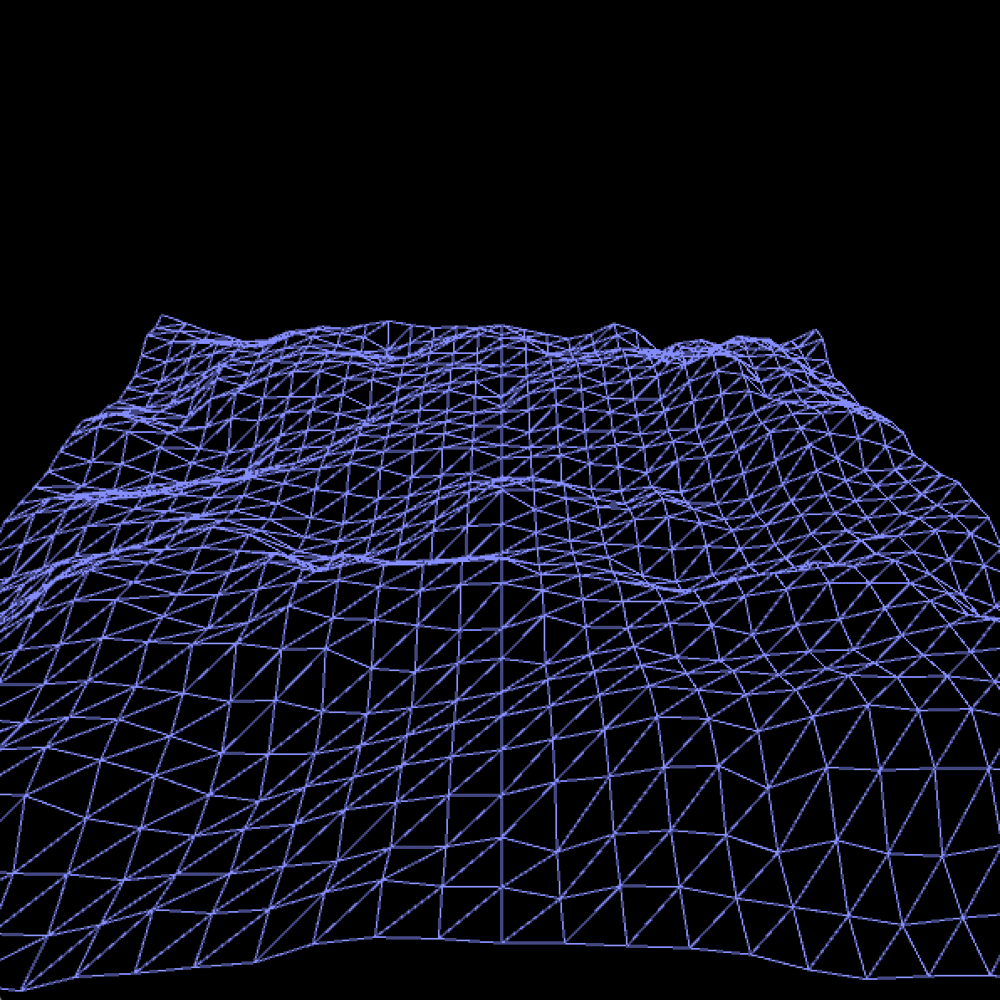
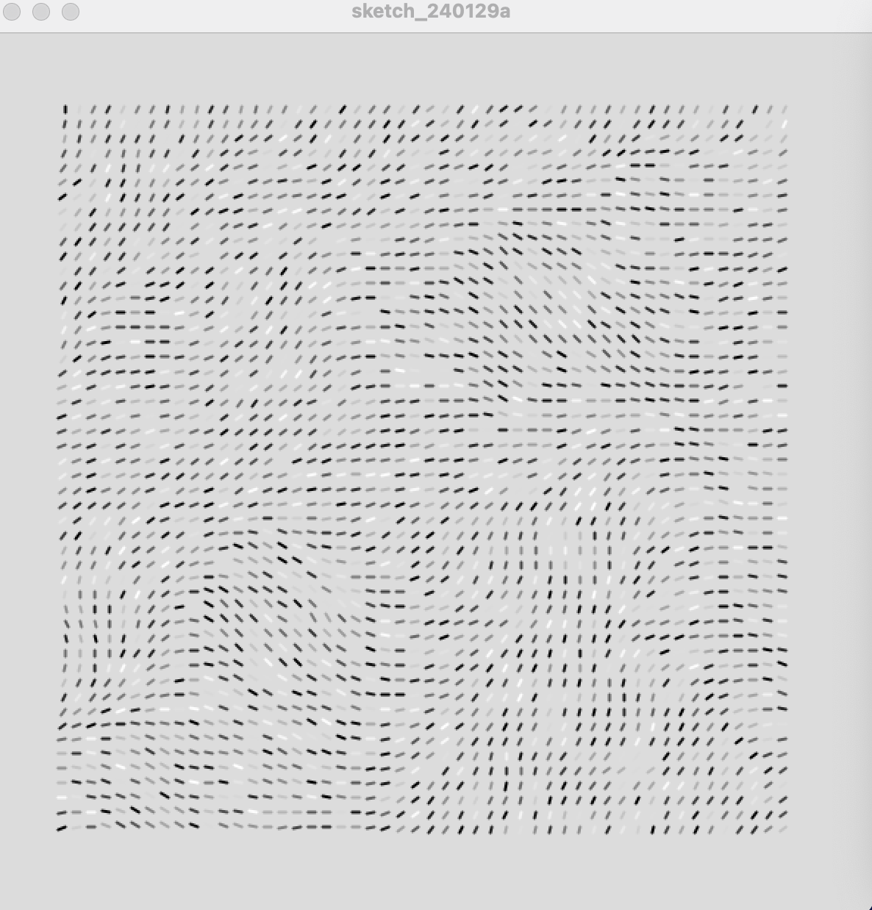
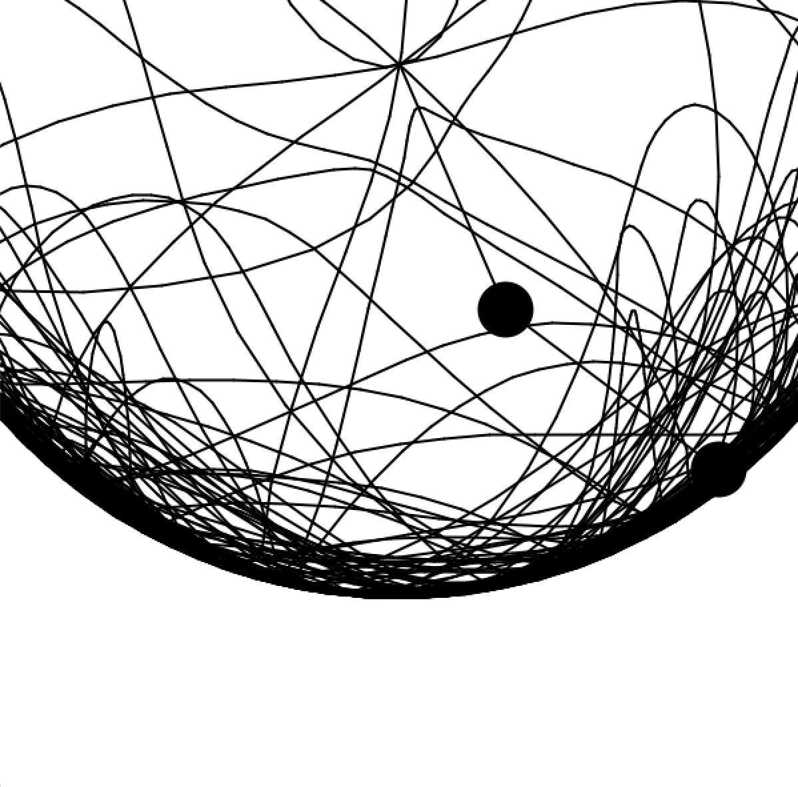
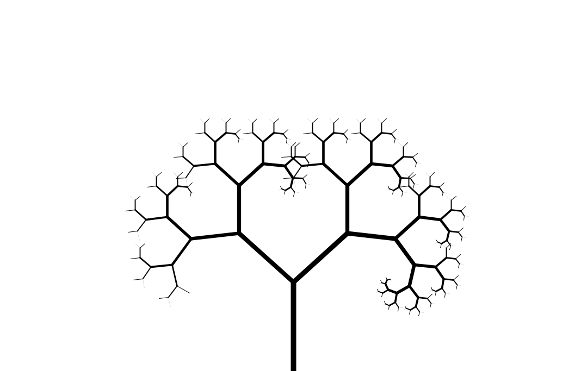
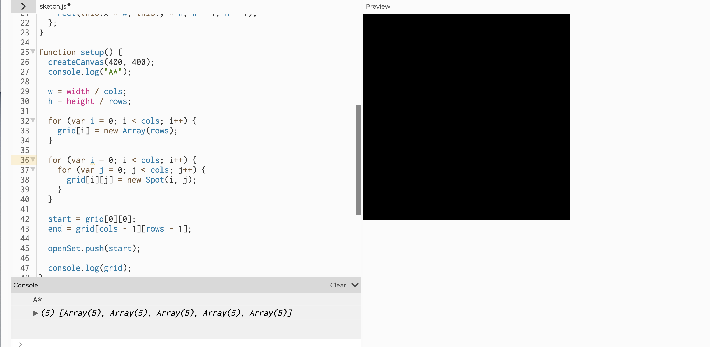

# 1/19 & 1/23 perlin noise.
Perline noise: Perline noise is a number that adds randomness to the generation. 

Perline noise resource:
https://www.youtube.com/watch?v=H7EwbkBWnmA&list=PLvN5Z3tTxXECdJ0JAyjtF46yorZJOw5nx&index=6 - leveling generation
https://www.youtube.com/watch?v=0emj42Bn-_Y - terrain generation
https://www.youtube.com/watch?v=na7LuZsW2UM&t=356s - talks about the beauty of Perlin noise  
https://www.youtube.com/watch?v=zx7GrlzYY7U - flow field tutorial that utilizes Perlin noise to move for the strokes

[here](waves.pde)

I played around with some of the videos and created a wave simulator using Perlin noise.

# 1/29/24

Today I worked on creating a flow field sim as I found one online and felt like doing it.
link to code:
[here](flow_fields.pde)
So what I did was follow through the tutorial and saw a lot of new functions in processing like final, and ArrayList<>

right here is an image

# 2/2/2024

Today I watched the videos about the Missipi River basin and the pandemic simulation by 1 brown and 3 blue.

What I found interesting is that LSU was able to model and simulate a way to return the land to the Louisiana Delta use by having a projection of a map. I guess this type of projection is very similar to the projects of sand to simulate the typography in children's museums. And I sort of want to do something similar with code where there is a 2d overview of a river bank with possible cities and you can simulate the motion of that river and create new paths or create dams that stop the river from continuing.

The pandemic simulation by 1 brown and the Blue is something I want to recreate except I want to introduce doctors and cured patients. This means that I would introduce multiple new variables like mortality rate that ensures that patients also have a chance of dying which means that the death of patients should be moved into a certain box(like why would you have the dead lying around.)

https://www.youtube.com/watch?v=alhpH6ECFvQ is a video I'm viewing about creating a 2d fluid simulation

https://www.youtube.com/watch?v=DxL2HoqLbyA video about entropy
# 2/8/2024 - 2/14/2024
On these days I was working on a fluid simulation that was an hour-long however I was trying to do the project in 3d and the video was doing it in 2d so when I came into a roadblock I didn't know what to do I asked for help but sadly they didn't know what was wrong now I decided to do something else which is making a double pendulum simulation 

https://www.youtube.com/watch?v=uWzPe_S-RVE This is the video

also now my processing is stuck in an infinite download state so the code I wrote will be here for right now

I got it fixed and I have fished working on it [here is the funny goofy code.](pendulme.pde)

here is an image of my code working as I use the acceleration = to pi.

# 2/23/2024

Today I worked on doing the factorial tree in processing using java what I found very intersenting is how the push and pop matrix works as I have used it before in my project during 9th grade. Moving on, I would to look more into push and pop maxtix and I have already found some videos on it. 

here:https://www.youtube.com/watch?v=OaBSHuP4xcE

here: https://www.youtube.com/watch?v=lalHizFnzp8

this is an image of what my has produced what I haded was instead of have lvl or leveling being added by 1 it would add by 2 (for somereason it would only work with 1 and 2) this caused a rounder and smoother branch that makes it more life like ( should probaly add leafs to honest.)

[here](fractal_thing) is the floder that has both of the files of my code. 

# 2/29/2024

for the past few days I have been trying to create a Pathfinder alrthinmoth however I have taken different tutorial videos 
https://www.youtube.com/watch?v=aKYlikFAV4k&t=1572s
However, it has been very hard to do anything as these tutorials didn't work [here](pathfinder.js) this is just the code

